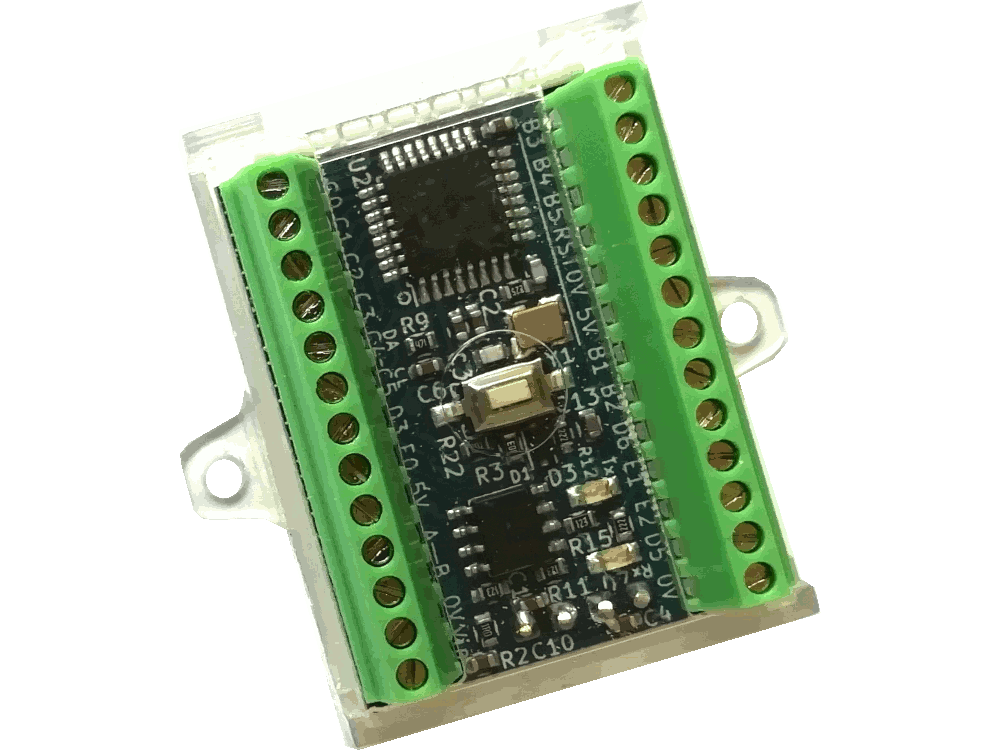
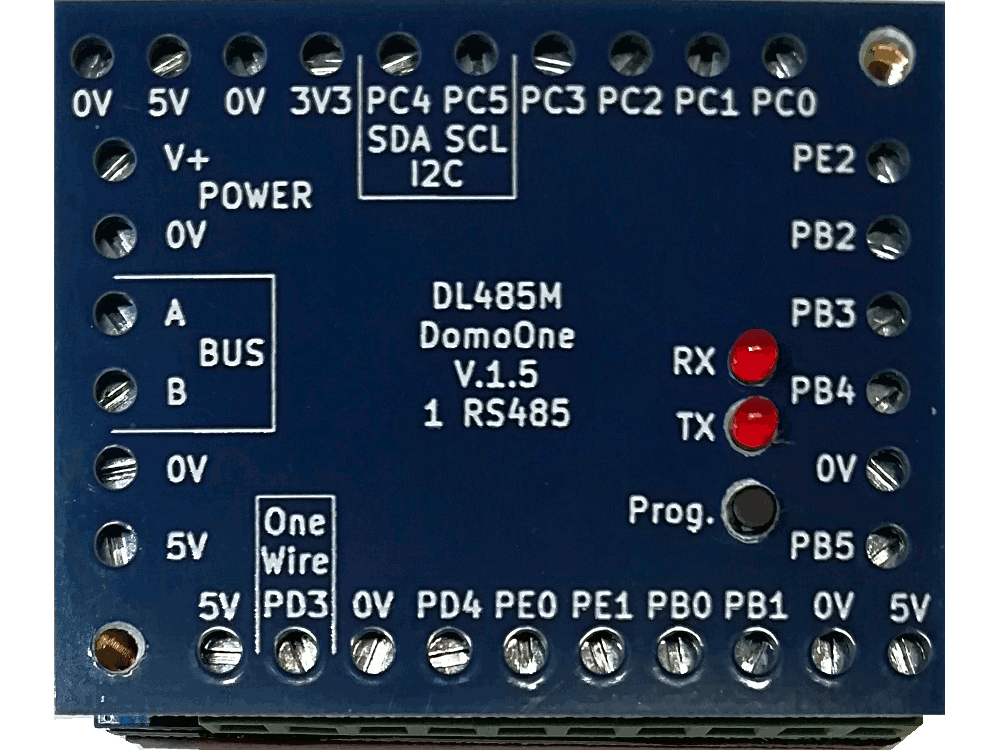
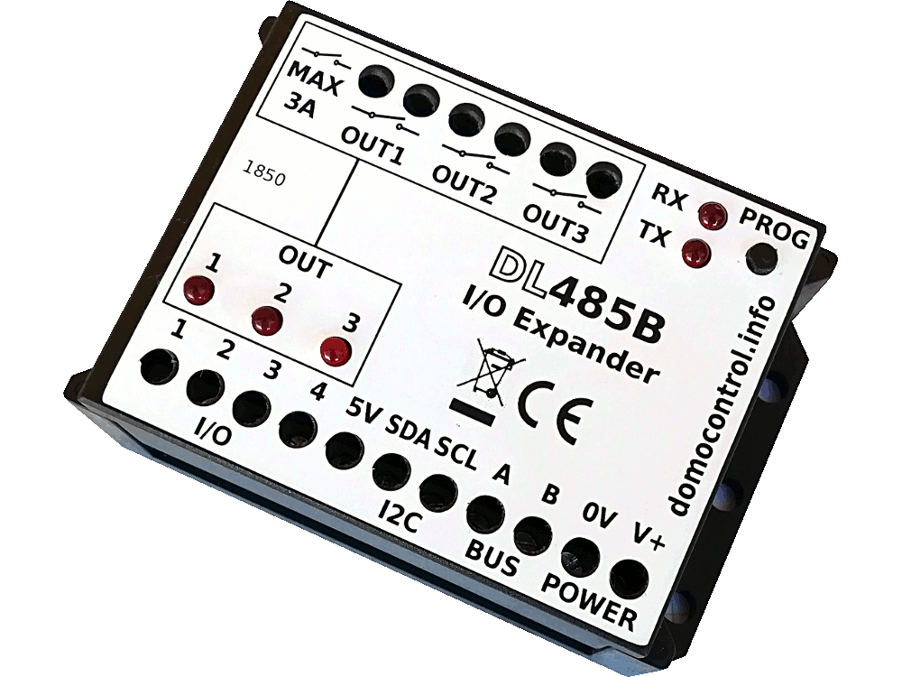
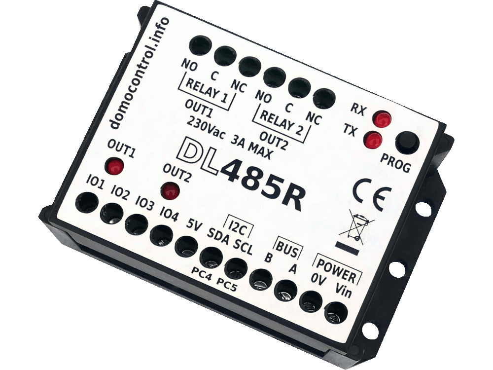

DL485 BUS Library
=================

    
    
    
    

## English

Library to command DL485 Board's with 2 twisted wires.

More informations at address <a href="https://www.domocontrol.info">Domocontrol.info</a>

## Italiano

Libreria per gestione schede domotiche serie DL485x

### Installazione

Verificare che siano installati python3 e git

Prelevare i file tramite il comando

git clone https://github.com/lucasub/DL485_BUS.git

Entrare nella cartella DL485_BUS con

cd DL485_BUS

All'interno sono presenti alcuni file tra cui:
- dl485p.py -> libreria
- config.json -> contiene tutta la configurazione delle schede
- TSL2561.py -> modulo per la gestione del sensore luminosità
- README.md -> questo file che descrive il sistema e l'installazione

### Impostazione del file di configurazione config.json

Vedere a questo indirizzo <a href="https://www.domocontrol.info/wiki">Domocontrol Wiki</a>

### Esecuzione del programma

Da terminale:

python3 dl485.py p

Verrà mostrato a video tutte le fasi con la programmazione e la ricezione dei vari dati

### Contribuire

Visita https://www.domnocontrol.info
