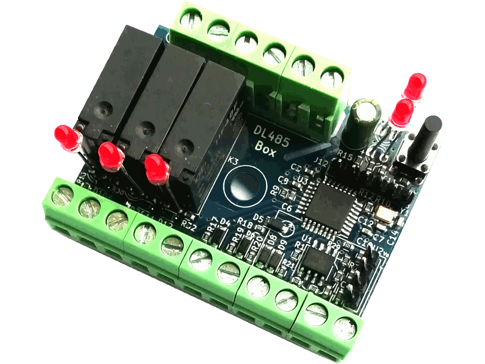

DL485 BUS Library
=================

## DL485P - Tree versions: 
<div>
    
    
    
</div>

Mini PCB board with many GPIO, OneWire, I2C, RS485 BUS, Switching step down power supply 5-24Vdc, push button and 2 LED
- DL485P with domocontrol firmware, 
- DL485PPLC with Domocontrol firmware and PLC system, 
- DL485P1 without firmware and step down power supply, for custom project. MCU APMEGA328PB 


## DL485B - Tree versions: 
<div>
    
    
    
</div>

BOX board with 6 GPIO, I2C, OneWire, RS485 BUS, tree relays 230Vac 3A, Switching step down power supply 5-24Vdc, push button and 5 LED
- DL485B with domocontrol firmware, 
- DL485BPLC with Domocontrol firmware and PLC system, 
- DL485B1 without firmware and step down power supply, for custom project. MCU APMEGA328PB  


## DL485R - Tree versions: 
<div>
    
    
    
</div>

RELAYS board with 6 GPIO, I2C, OneWire, RS485 BUS, two spdt relays, Switching step down power supply 5-24Vdc, push button and 4 LED
- DL485R with domocontrol firmware, 
- DL485RPLC with Domocontrol firmware and PLC system, 
- DL485R1 without firmware and step down power supply, for custom project. MCU APMEGA328PB  


## DL485M - Tree versions: 
<div>
    
    
    
</div>

MAXY board with many GPIO, I2C, OneWire, RS485 BUS, Switching step down power supply 5-24Vdc, push button and 2 LED
- DL485M With domocontrol firmware, 
- DL485MPLC With Domocontrol firmware and PLC system, 
- DL485M1 Without firmware, for custom project. MCU APMEGA328PB


## DL485Dx - Two versions: 
<div>
    
    
</div>

SMART Dimmer LED with 1 or 3 channels, master button, programmable, BUS RS485 to control also by Domoticz or other home automation system (Python3 module)
- DL485D Smart dimmer LED 1 channel,
- DL485D3 Smart dimmer LED 3 channels

# English

Library to command DL485 Board's by only 2 twisted wires (RS485).

More informations at address <a href="https://wiki.my-tek.it/doku.php">Domocontrol.info</a>

### Functionality of the DL485x boards

The DL485x boards are nodes that send their data packets in turn on the RS485 network without stall. The data are available to all connected nodes and possibly also to a possible general control system such as Domoticz and / or other home automation systems.

At rotation, each node, if powered and connected, sends its data packet on the BUS, when instead a node is turned off, disconnected or busy, it will not enter the network and the tour will continue with the next node ready to operate.

If node has no information to send, it just sends a very short packet called Ping to synchronize the whole network.

All the DL485x boards have the possibility of:
- read and write digital I/O
- Read analog inputs
- Activate the PWM outputs
- Read OneWIRE DS18B20 temperature sensors
- Read I2C sensors (AM2320, BME280, TLS2561 ....)

On request, is possible to have DL485B with Power Meter system that can read:
- AC Voltage
- AC Current
- Real power,
- Apparent power,
- Cosphi
- Current phase

The nodes exchange information by RS485 BUS and are connected via a simple and economical twisted pair that can reach hundreds of meters, 
with very low consumption and the absence of high-frequency electromagnetic waves. 

- Possibility of having a PLC on board on each card to automate the various I/O: example lighting of lights in real time on event.
- PLC functions available: equal, and, or, xor, odd, even, toggle_on, toggle_on_off, timer, autostart_timer, test_nio_>=_n, test_nio_into_n test_schmitt_nio, analog_in_=_n, analog_in_>_n, analog_in_>=_n, analog_in_schmitt, if_analog_in1_=_analog_in2, if_analog_in1_>_analog_in2, if_analog_in1_>=_analog_in2, if_analog_in1_-_analog_in2_schmitt_value, analog_in_+_n, analog_in_-_n, analog_in_*_n, analog_in_/_n, analog_in_%_n, 
analog_in_lim_max_n, analog_in_lim_min_n, analog_in1_+_analog_in2, analog_in1_-_analog_in2, analog_in1_*_analog_in2, analog_in1_/_analog_in2, analog_in1_%_analog_in2,  analog_in1_min_analog_in2, analog_in1_max_analog_in2, or_transition_on, last_change, last_change_all, time_meter, counter_up_dw, counter_up, counter_dw, powermeter, power_on.
More information on <a href="https://wiki.my-tek.it/doku.php?id=plc">PLC functions</a>

### Installation

1. Update and Install the following packages from the terminal: 
```
sudo apt update
sudo apt upgrade
sudo apt install python3-dev python3-serial git python3-pip
```

2. Installation DL485_BUS_2:
```
cd /home/pi/
git clone https://github.com/lucasub/DL485_BUS_2.git
```

3. Enter the DL485_BUS_2 folder with:

```
cd ~/DL485_BUS_2
```

4. Inside there are some files including:
- dl485p.py -> python3 file to node management
- config.json -> contains all the configuration of the boards to be controlled
- bus_dl485.py -> RS485 and serial BUS management module
- log.py -> module to printing LOGs on screen and files
- bme280.py -> BME280 temperature - humidity - pressure management module - to be completed -
- tsl2561.py -> module for managing the brightness sensor
- dl485_mqtt.py -> MQTT management module - to be completed -
- README.md -> this file describing the system and installation 

### Setting the configuration file config.json  

See at this address <a href="https://wiki.my-tek.it/doku.php"> Domocontrol Wiki </a> 

### Execution of the program 

From terminal:

```
python3 dl485.py p
```


Send configuration 


Monitoring of I/O and sensors 


All the phases with the programming and reception of the various data will be shown on the screen 

### Contribute 

If you want to contribute to the project, you will be welcome. 

See https://wiki.my-tek.it/doku.php


# Italiano

Libreria per comandare la scheda DL485 con soli 2 fili twistati (RS485).

Maggiori informazioni all'indirizzo <a href="https://wiki.my-tek.it/doku.php"> Domocontrol.info </a> 

### Funzionalità delle schede DL485x


Le schede DL485x sono nodi che inviano a turno i propri pacchetti di dati sulla rete RS485 senza stallo. 
I dati sono a disposizione di tutti i nodi collegati ed eventualmente anche di un eventuale sistema di controllo generale come Domoticz e / o altri sistemi domotici.

A rotazione ogni nodo, se alimentato e connesso, invia il proprio pacchetto dati sul BUS,
quando invece un nodo è spento, disconnesso o occupato, non entrerà in rete e il tour proseguirà con il nodo successivo pronto ad operare.

Se il nodo non ha informazioni da inviare, invia solo un pacchetto molto breve chiamato Ping per sincronizzare l'intera rete.

Tutte le schede DL485x hanno la possibilità di:
- leggere e scrivere I / O digitali
- Leggere gli ingressi analogici
- Attiva le uscite PWM
- Leggi sensori di temperatura OneWIRE DS18B20
- Leggere i sensori I2C (AM2320, BME280, TLS2561 ....)

A richiesta è possibile avere DL485B con sistema Power Meter in grado di leggere:
- Tensione AC
- Corrente AC
- Potenza reale,
- Poteza apparente,
- Cosphi
- Sfasamento della tensione/corrente

I nodi si scambiano informazioni tramite BUS RS485 e sono collegati tramite un semplice ed economico doppino intrecciato che può raggiungere centinaia di metri,
con consumi molto bassi e assenza di onde elettromagnetiche ad alta frequenza.

- Possibilità di avere un PLC a bordo su ogni scheda per automatizzare i vari I / O: esempio accensione luci in tempo reale su evento.
- Funzioni PLC disponibili: uguale e, o, xor, dispari, pari, toggle_on, toggle_on_off, timer, autostart_timer, test_nio _> = _ n, test_nio_into_n test_schmitt_nio, analog_in _ = _ n, analog_in _> _ n, analog_in _> = _ n, analog_in_schmitt _analog_in2, if_analog_in1 _> _ analog_in2, if_analog_in1 _> = _ analog_in2, if_analog_in1 _-_ analog_in2_schmitt_value, analog_in _ + _ n, analog_in _-_ n, analog_in _ * _ n, analog_in _ / _ n, analog_in _
analog_in_lim_max_n, analog_in_lim_min_n, analog_in1 _ + _ analog_in2, analog_in1 _-_ analog_in2, analog_in1 _ * _ analog_in2, analog_in1 _ / _ analog_in2, analog_in1 _% _ analog_in2, analog_in1_min_analog_in2, analog_in1_max_analog_in2, or_transition_on, last_change, last_change_all, time_meter, counter_up_dw, counter_up, counter_dw, PowerMeter, power_on.
Maggiori informazioni sulle <a href="https://wiki.my-tek.it/doku.php?id=plc"> funzioni PLC </a> 

### Installazione

1. Aggiornare e Installare i seguenti pacchetti da terminale:
```
sudo apt update
sudo apt upgrade
sudo apt install python3-dev python3-serial git python3-pip
```

2. Installare la libreria DL485_BUS
```
cd /home/pi/
git clone https://github.com/lucasub/DL485_BUS_2.git
```

3. Entrare nella cartella DL485_BUS_2 con

```
cd ~/DL485_BUS_2
```

4. All'interno sono presenti alcuni file tra cui:
- dl485p.py -> modulo python gestione nodi
- config.json -> contiene tutta la configurazione delle board da controllare
- bus_dl485.py -> modulo gestione BUS RS485 e seriale
- log.py -> modulo per la stampa dei LOG su schermo e file
- bme280.py -> modulo gestione temperatura - umidità - pressione BME280 --da completare--
- tsl2561.py -> modulo per la gestione del sensore luminosità
- dl485_mqtt.py -> modulo di gestione MQTT --da completare--
- README.md -> questo file che descrive il sistema e l'installazione

### Impostazione del file di configurazione config.json

Vedere a questo indirizzo <a href="https://wiki.my-tek.it/doku.php">Domocontrol Wiki</a>

### Esecuzione del programma

Da terminale:

```
python3 dl485.py p
```


Invio configurazione


Monitoraggio degli I/O e sensori


Verrà mostrato a video tutte le fasi con la programmazione e la ricezione dei vari dati

### Contribuire

Se vuoi icontribuire al progetto, sarai il benvenuto.

Visita https://wiki.my-tek.it/doku.php
